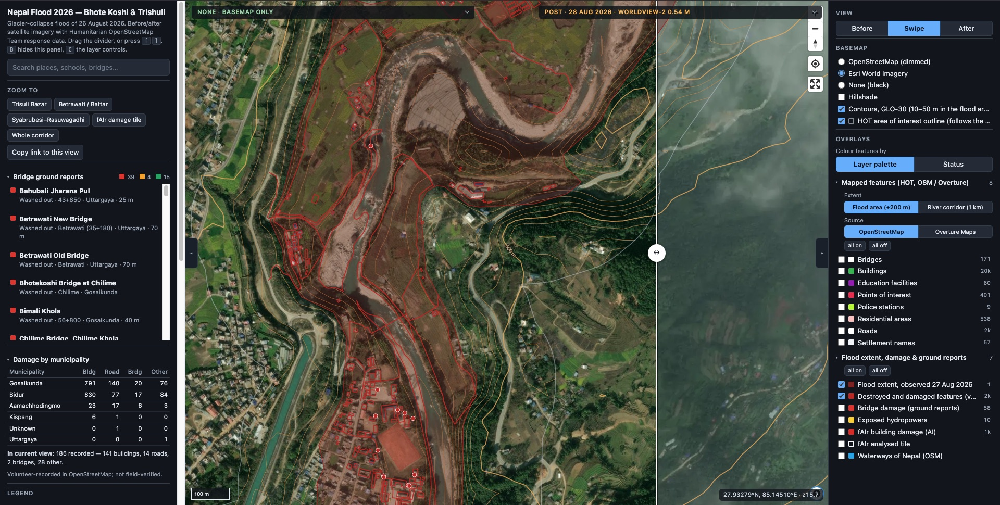

# Nepal Flood 2026 — Bhote Koshi & Trishuli

Interactive map of the 26 August 2026 glacier-collapse flood along the Lhende, Bhote Koshi and
Trishuli rivers, Nepal. Merges two sources:

- **Base layers**: open satellite imagery (Sentinel-1/2, PlanetScope, SkySat, Pelican, Vantor
  WorldView-2/3 and Legion) registered and tiled for before/after comparison, plus Copernicus
  GLO-30 contours. Carried over from the earlier `trisuli-flood-map` project.
- **Detail layers**: Humanitarian OpenStreetMap Team response data from HDX — flood extent,
  OSM/Overture features with Standing/Damaged/Destroyed status, fAIr AI damage, ground-reported
  bridge conditions.
- **Road condition**: Copernicus EMS rapid-mapping grades (EMSR927) for every road and bridge
  segment in four assessed areas, plus a computed overlay of roads inside the observed flood extent.

*Trisuli Bazar reach, swipe view. Left: pre-flood Esri World Imagery. Right: Vantor WorldView-2,
28 Aug 2026. Dark red: observed flood extent and volunteer-recorded destroyed or damaged features
from OpenStreetMap; orange: GLO-30 contours. [Open this view](https://shrestharajat.github.io/nepal-flood-map/#m=swipe&pre=none&post=post_wv02_20260828&c=85.15298%2C27.92922&z=15.68&s=73.3&b=esri&ov=-hot_bridges%2C-bridge_damage%2C-hydro%2C-fair%2C-fair_aoi).*

Layout:

- `index.html` — the map (MapLibre GL, swipe compare)
- `tiles/<layer>/{z}/{x}/{y}.webp` — Web Mercator imagery pyramids; `tiles/contours/` vector tiles
- `data/imagery.json` — imagery catalogue read by the app
- `data/hdx/` — HDX downloads (GeoJSON + PMTiles), 5 Sep 2026 snapshot
- `tools/` — reproducible build scripts, including `imagery_watch.py` (6-hourly scan for new scenes; see
  docs/ARCHITECTURE.md)

## Licensing

The code in this repository (`index.html`, `app/`, `tools/`, `docs/`) is MIT
licensed, see [`LICENSE`](LICENSE). The imagery and data under `data/` and
`tiles/` are third-party works under their own terms — several imagery layers
are non-commercial (CC BY-NC 4.0) and vector data is ODbL. See
[`docs/LICENSING.md`](docs/LICENSING.md) for the full source-by-source
breakdown and what it means for reuse.

## Disclaimer

This is an independent volunteer visualisation, not an official government or
humanitarian source. Damage statuses (Standing / Damaged / Destroyed), fAIr
AI damage detections, and bridge ground reports are provisional remote and
crowd assessments as of the 5 September 2026 HDX snapshot, and may be wrong,
incomplete, or outdated. Do not use this map for navigation or operational
decision-making without independent verification. Imagery layers are
registered approximately; positions may be offset by tens of metres.
